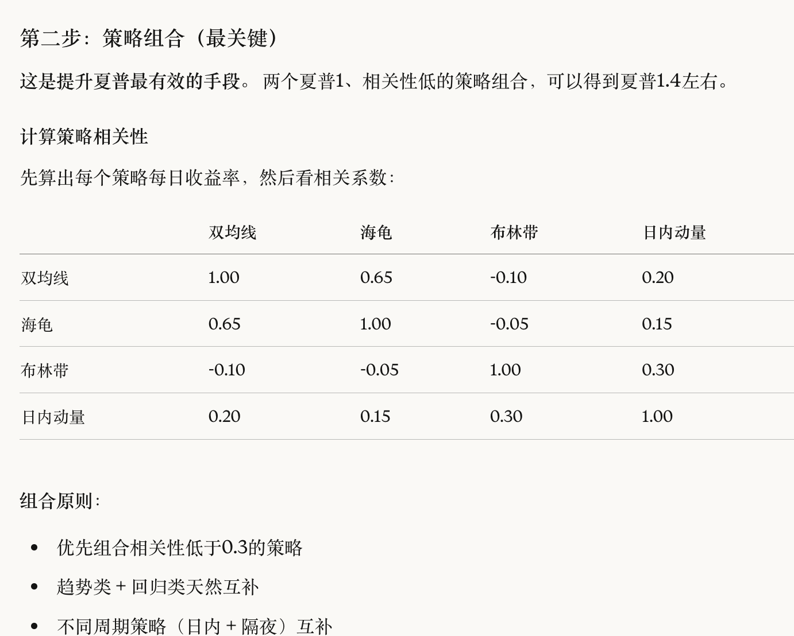
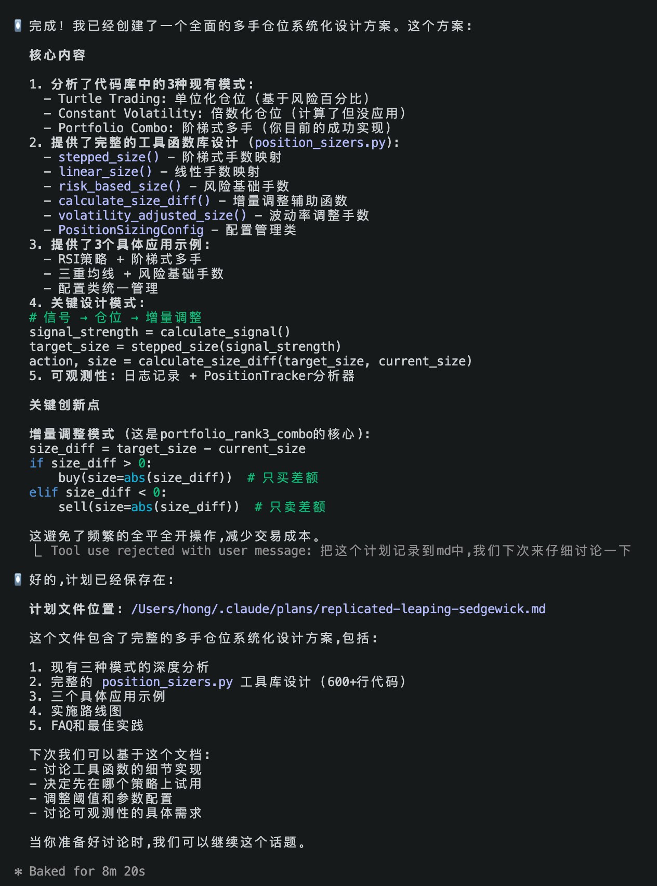
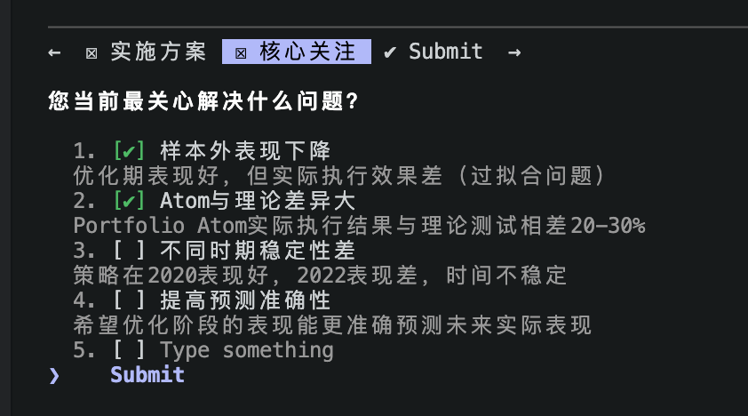

1. 加一个多个结果一起跑然后相关性分析的代码

2. 加一个多个结果一起跑然后将结果整理到一张表中的代码

3. 后续的仓位管理、风险管理、测试等：https://claude.ai/chat/7e1839ab-abdf-4d05-be64-304d08362d2f
4. 研究其他期货：https://claude.ai/chat/12cf948f-1c4c-4334-8c34-efa52c6f6d79
5. 还是量化为主，基本面作为否定量化的终极办法，不要一开始先陷入基本面的一些所谓经验中
6. https://claude.ai/chat/7e1839ab-abdf-4d05-be64-304d08362d2f
7. 
8. 跑代码的步骤：PORTFOLIO_WORKFLOW_GUIDE.md
9. 

python walk_forward_validator.py --data-start 20200101 --data-end 20241231--timeframe d1 --train-months 24 --test-months 12 --step-months 12 --top-n 20